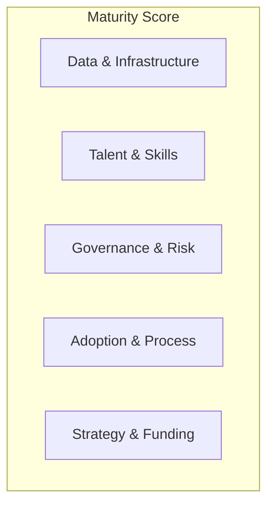

# AI Maturity Assessment

> **Strategic anchor B.** A scored maturity model across five dimensions, plus a self-assessment tool any organization can actually run to find out where it really is.

   

## The tool

**[km-ai-maturity-assessment.netlify.app](https://km-ai-maturity-assessment.netlify.app)** — no login, nothing leaves your browser. Score the five dimensions with sliders → get your radar profile, your binding constraint, and exactly what the next level looks like for it.

## The problem
Leaders ask "are we behind on AI?" and get vibes, not a diagnosis. This model turns that question into a scored, defensible assessment with a clear next move.

## The five dimensions

Each dimension is scored **Level 1–5**:

| Level | Label | Signal |
|-------|-------|--------|
| 1 | Ad hoc | Experiments, no strategy |
| 2 | Emerging | Pilots, isolated wins |
| 3 | Operational | Repeatable delivery, some governance |
| 4 | Systemic | Portfolio-managed, governed, measured |
| 5 | Transformative | AI-native operating model |

## What's in this repo
| Path | Contents |
|------|----------|
| `docs/maturity-model.md` | Full rubric: 5 dimensions × 5 levels with descriptors |
| `docs/sample-report.md` | Example diagnostic output + recommendations ("Northwind Financial") |
| `tool/` | Self-assessment spreadsheet |
| `index.html` | Source for the interactive web tool |
| `content/` | Medium draft + LinkedIn slices |

## Status
🟢 Complete — full [5×5 rubric](docs/maturity-model.md), worked [sample diagnostic](docs/sample-report.md), and the [interactive web tool](https://km-ai-maturity-assessment.netlify.app) (slider scoring → radar chart → binding-constraint diagnosis). Deployed via Netlify; auto-updates on push to main.

---
> **Strategic takeaway:** "Are we behind?" is the wrong question. "Which dimension is our binding constraint, and what does the next level cost?" is the one that funds the right work. Most orgs over-invest in models while stuck at Level 2 on governance and adoption.

📎 Related: [AI Strategy Operating Model](https://github.com/kmanning-projects/ai-strategy-operating-model) · [Responsible AI Governance](https://github.com/kmanning-projects/responsible-ai-governance) · 📖 Book Ch. 2
