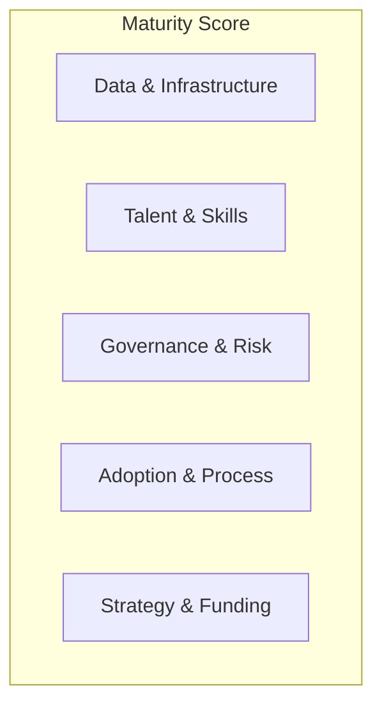

# AI Maturity Assessment

> **Strategic anchor B.** A scored maturity model across five dimensions, plus a self-assessment tool any organization can actually run to find out where it really is.

  

## The problem
Leaders ask "are we behind on AI?" and get vibes, not a diagnosis. This model turns that question into a scored, defensible assessment with a clear next move.

## The five dimensions

Each dimension is scored **Level 1–5**:

| Level | Label | Signal |
|-------|-------|--------|
| 1 | Ad hoc | Experiments, no strategy |
| 2 | Emerging | Pilots, isolated wins |
| 3 | Operational | Repeatable delivery, some governance |
| 4 | Systemic | Portfolio-managed, governed, measured |
| 5 | Transformative | AI-native operating model |

## What's in this repo
| Path | Contents |
|------|----------|
| `docs/maturity-model.md` | Full rubric: 5 dimensions × 5 levels with descriptors |
| `tool/` | Self-assessment tool (spreadsheet **and** a small web app) |
| `docs/sample-report.md` | An example diagnostic output + recommendations |
| `content/` | Medium draft + LinkedIn slices |

## The tool
- **v1:** a scored spreadsheet (`tool/assessment.xlsx`) — instant, zero-friction.
- **v2 (stretch):** a static web app (built locally, hosted on GitHub Pages) that produces a radar chart + recommendations. Built with Claude Code; no backend, no cost.

## Status
🟢 v1 + v2 complete — full [5×5 rubric](docs/maturity-model.md), a worked [sample diagnostic](docs/sample-report.md) ("Northwind Financial"), the scored [spreadsheet tool](tool/), **and an interactive web app** ([`index.html`](index.html): slider scoring → radar chart → binding-constraint diagnosis). Open `index.html` locally, or publish free via GitHub Pages once public ([how](tool/README.md)).

---
> **Strategic takeaway:** "Are we behind?" is the wrong question. "Which dimension is our binding constraint, and what's the next level look like?" is the one that funds the right work. Most orgs over-invest in models while stuck at Level 2 on governance and adoption.

📎 Related: [Strategy Operating Model](../ai-strategy-operating-model) · [Operating Model Playbook](../ai-operating-model-playbook) · 📖 Book Ch. 2
