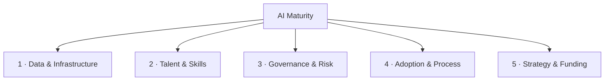

# The AI Maturity Model

A scored model across **five dimensions**, each rated **Level 1–5**. It exists to answer one question better than vibes can: *which dimension is the binding constraint, and what does the next level cost?*

## The levels (general shape)
| Level | Label | Signal |
|-------|-------|--------|
| 1 | Ad hoc | Experiments, no strategy, individual heroics |
| 2 | Emerging | Pilots, isolated wins, no repeatability |
| 3 | Operational | Repeatable delivery, some governance, measured |
| 4 | Systemic | Portfolio-managed, governed, funded, scaled |
| 5 | Transformative | AI-native operating model; durable advantage |

> **Most organizations cluster at Level 2** overall — and are usually *unevenly* mature: a Level-3 data org stuck at Level-1 governance. The average score hides the constraint; the per-dimension profile reveals it.

---

## Dimension 1 — Data & Infrastructure
*Can we feed and run AI reliably?*

| Level | Descriptor | Evidence signals |
|-------|-----------|------------------|
| 1 | Data siloed, quality unknown; no AI infra | Spreadsheets, manual exports, no pipelines |
| 2 | Some accessible data; ad hoc cloud/AI tooling | One-off datasets prepared per project |
| 3 | Governed data for key domains; repeatable pipelines | Catalog exists; CI for data; managed AI platform |
| 4 | Self-serve data + feature reuse; scalable serving | Feature store / vector infra; observability |
| 5 | Real-time, high-quality data as a product; elastic infra | Data products with SLAs; infra is a non-issue |

## Dimension 2 — Talent & Skills
*Do we have the people, and is the org getting smarter?*

| Level | Descriptor | Evidence signals |
|-------|-----------|------------------|
| 1 | No dedicated skills; reliance on individuals | Nobody owns AI |
| 2 | A few practitioners; key-person risk | One data scientist, no bench |
| 3 | A core team + defined roles; some literacy programs | Job families exist; training started |
| 4 | Capability embedded in business units; broad literacy | Champions in BUs; curriculum live |
| 5 | AI fluency is cultural; attracts top talent | Hiring magnet; leaders are AI-literate |

## Dimension 3 — Governance & Risk
*Can we deploy AI safely and defensibly?*

| Level | Descriptor | Evidence signals |
|-------|-----------|------------------|
| 1 | No policy, no oversight | Shadow AI; unknown exposure |
| 2 | Ad hoc reviews; informal rules | Case-by-case, inconsistent |
| 3 | Risk-tiered intake; policy; model documentation | Registry, model cards, sign-offs |
| 4 | Monitored in production; auditable; standards-aligned | Evals in CI; NIST/EU-AI-Act mapping |
| 5 | Governance as enabler; proactive, automated | Controls speed delivery, not slow it |

## Dimension 4 — Adoption & Process
*Does AI actually change how work gets done?*

| Level | Descriptor | Evidence signals |
|-------|-----------|------------------|
| 1 | Demos, no production use | Pilots that never ship |
| 2 | Isolated production use; low trust | One tool used by few |
| 3 | Embedded in several core processes; measured value | KPIs moved; users rely on it |
| 4 | AI is default in many workflows; change managed | Process redesigned around AI |
| 5 | AI-native processes; continuous improvement | The business runs on it |

## Dimension 5 — Strategy & Funding
*Is there a managed, funded plan — or a wish?*

| Level | Descriptor | Evidence signals |
|-------|-----------|------------------|
| 1 | No strategy; sporadic spend | Reactive, hype-driven |
| 2 | Stated ambition; project-by-project funding | Slideware, no portfolio |
| 3 | Portfolio + themes + staged funding | Scorecard, gates, sponsor |
| 4 | Actively managed portfolio; kills underperformers | Quarterly re-prioritization |
| 5 | AI integral to corporate strategy; durable investment | Board-level, multi-year |

---

## Scoring & interpretation
1. Rate each dimension 1–5 using the descriptors + evidence (use the [tool](../tool/)).
2. Plot the five scores as a **radar chart** — the *shape* matters more than the average.
3. **Find the binding constraint:** the lowest dimension with the highest leverage on outcomes (often Governance or Adoption, even when Data/Talent look fine).
4. **Define the next level:** read the descriptor one level up for that dimension — that's your concrete next investment.

> The recommendation engine doesn't say "do everything." It says: *raise your weakest high-leverage dimension by one level, and stop over-investing in dimensions already ahead of your constraint.*

See a full diagnosis in [sample-report.md](sample-report.md).
